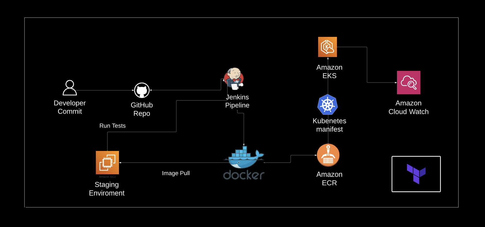

# Devops-Project

## A CI/CD piplines to deploy a three tier application where microservice tools and automation scripts are used. 

The Idea behind this project was to to create a pipline for deploying a three tier application to understand the devops life-cycle process. In order to make this project more challenging than a simple deployment pipeline using only two tools, was to utilise all the most popular tools used in the industry such as Jenkins, Docker-compose, Terraform, Shell-scripting, AWS Services And Kubernetes.

  
  

The Diagram above describes the following:

* Developers commit and push the code to a repository.
* The Jenkins server picks up on a webhook trigger.
* Jenkins then clones the repository.
* AWS resources are provisioned through Terraform via jenkins script.
* Jenkin then builds Docker images for the application.
* Jenkins then deploys the image onto a staging enviroment where tests are applied.
* If the test result all check out then Jenkins then pushes the Docker images to ECR repository.
* Kubernetes Manifest files are then deployed for EKS cluster.
* Application is then deployed on the EKS cluster.
* AWS CloudWatch Then monitors the entire infrastructure. 

