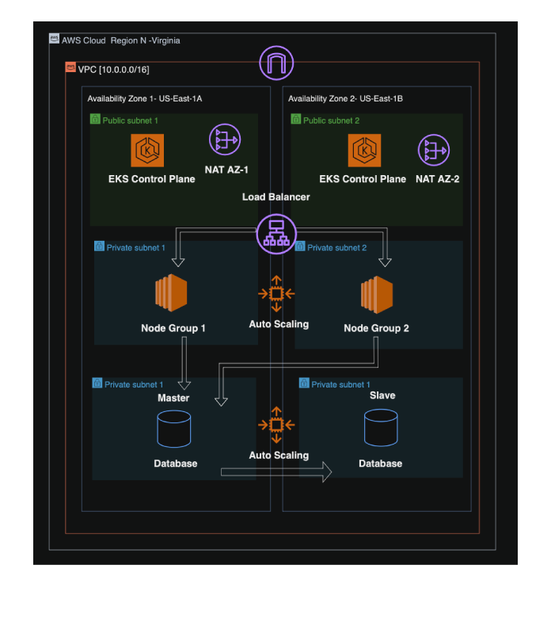

# Devops-Project

## A CI/CD piplines to deploy a three tier application. 

### Description 

The Idea behind this project was to to create a pipline for deploying a three tier application to understand the devops life-cycle process. In order to make this project more challenging than a simple deployment pipeline using only two tools. Is to utilise all the most popular tools used in the industry such as Jenkins, Docker-compose, Terraform, Shell-scripting, AWS Services And Kubernetes.

## Screenshots

  
  

## Overview

The Diagram above describes the following:

* Developers commit and push the code to a repository.
* The Jenkins server picks up on a webhook trigger.
* Jenkins then clones the repository.
* AWS resources are provisioned through Terraform via jenkins script.
* Jenkin then builds Docker images for the application.
* Jenkins then deploys the image onto a staging enviroment where tests are applied.
* If the test result all check out then Jenkins then pushes the Docker images to ECR repository.
* Kubernetes Manifest files are then deployed for EKS cluster.
* Application is then deployed on the EKS cluster.
* AWS CloudWatch Then monitors the entire infrastructure. 


## Prerequisites

Before using this DevOps pipeline, make sure you have the following prerequisites installed and configured:

- [Jenkins](https://www.jenkins.io/)
- [Docker](https://www.docker.com/)
- [Kubernetes](https://kubernetes.io/) (Optional, if deploying to Kubernetes)
- [AWS CLI](https://aws.amazon.com/cli/) (Optional, if deploying to AWS)

## Pipeline Configuration

1. Clone this repository:

    ```bash
    git clone https://github.com/your-username/your-repo.git
    cd your-repo
    ```

2. Create a Jenkins pipeline job and configure it to pull the Jenkinsfile in the repository.

3. Create Jenkins credentials for sensitive information like DockerHub credentials, AWS credentials, etc.

4. Configure your pipeline job with the necessary environment variables and credentials.

5. Set up webhook triggers in your version control system (e.g., GitHub) to start the pipeline automatically when changes are pushed.

## Usage

1. Push changes to your project's repository on GitHub. This will trigger the Jenkins pipeline.

2. The Jenkins pipeline will automatically build and test your application. If the tests pass, it will deploy the application to the target environment.

3. Monitor the pipeline's progress in Jenkins and the application's status in your target environment.

4. If something goes wrong, the pipeline will provide feedback on what went wrong. You can check the Jenkins console output for detailed information.

## Customization

You can customize this pipeline to fit your specific needs. Here are some ways to do that:

- Modify the Jenkinsfile to include additional build and deployment steps.
- Change the target deployment environment (e.g., AWS, Kubernetes, etc.) by modifying the deployment scripts in the `deploy/` directory.
- Add more tests or integrations as needed.

## Support

If you encounter any issues or have questions, feel free to [open an issue](https://github.com/your-username/your-repo/issues) or [contact us](mailto:your-email@example.com).

---

This DevOps pipeline template provides a starting point for automating your project's build, test, and deployment processes. Make sure to adapt it to your specific project's requirements and infrastructure.

